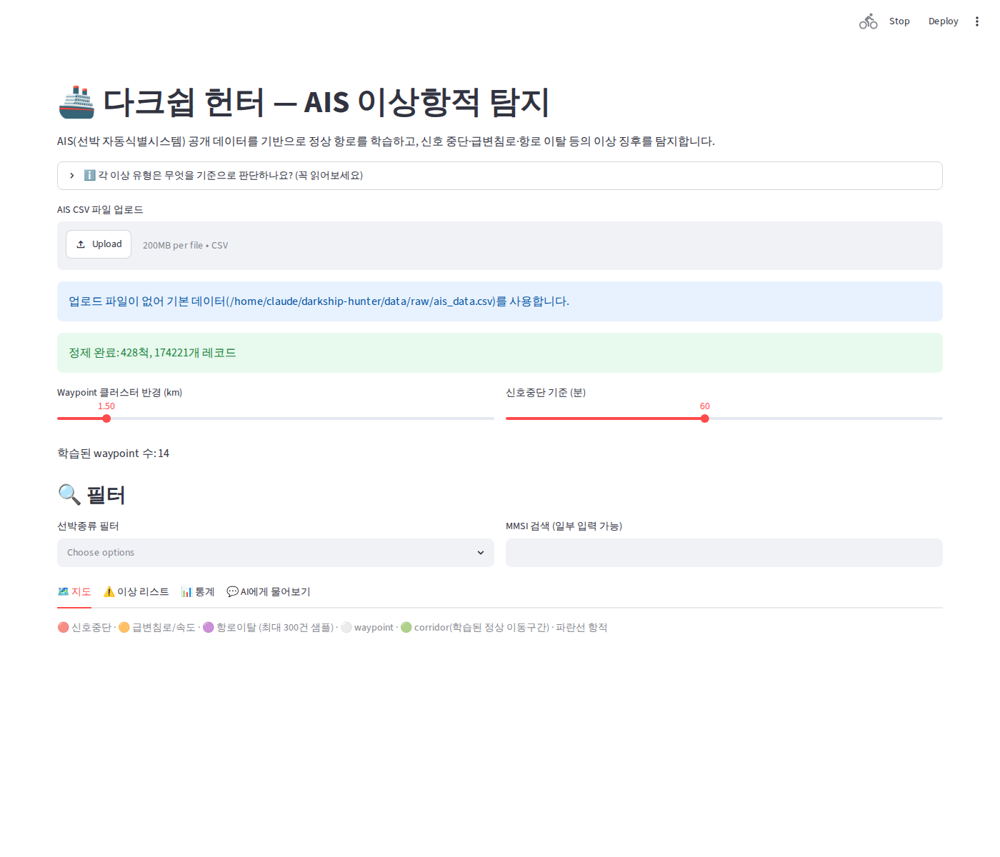
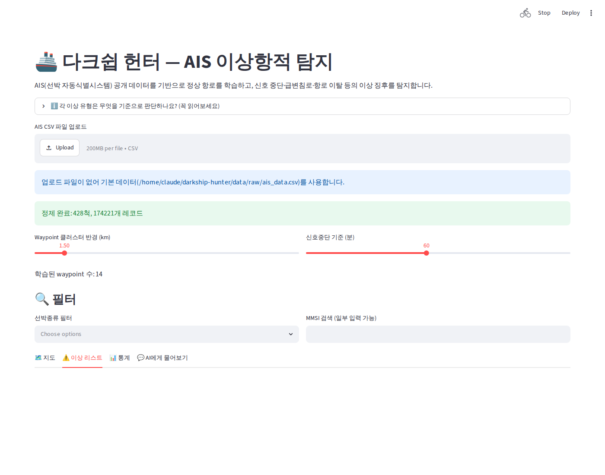
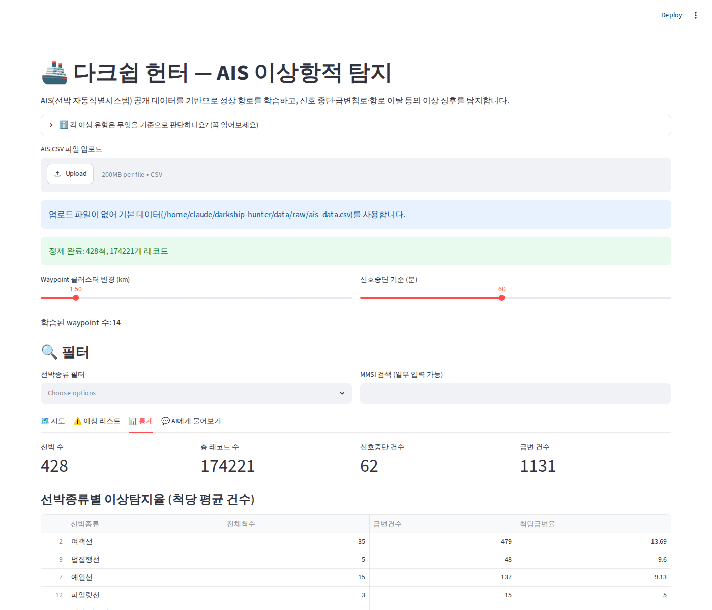
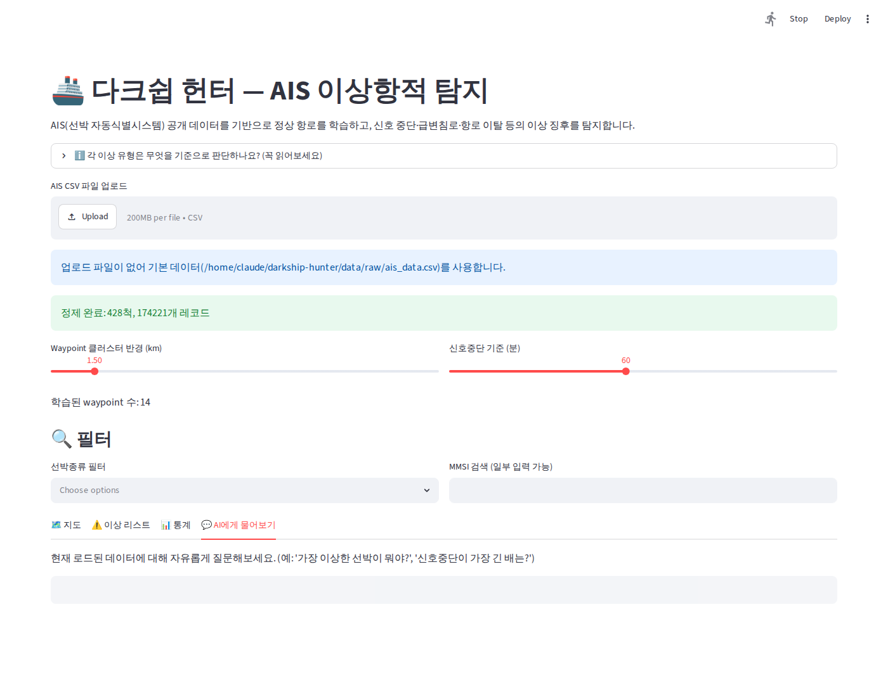

# 🚢 DarkShip Hunter

> AIS(선박 자동식별시스템) 공개 데이터를 기반으로, 선박의 이상 항적을 탐지하고 AI가 자연어로 설명해주는 프로젝트

🔗 **[라이브 데모 바로가기](https://darkship-hunter-xhy5a3vtiuhig8juotfttu.streamlit.app/)**






---

## 목차

1. [문제의식](#문제의식)
2. [핵심 기능](#핵심-기능)
3. [로컬 실행 방법](#로컬-실행-방법)
4. [아키텍처](#아키텍처)
5. [데이터 출처](#데이터-출처)
6. [실행 결과](#실행-결과-2024-01-01-sf-bay-데이터-기준)
7. [검증 — 탐지 결과가 실제로 말이 되는가](#검증--탐지-결과가-실제로-말이-되는가)
8. [한계점 (정직하게 명시)](#한계점-정직하게-명시)
9. [로드맵](#로드맵)
10. [트러블슈팅](#트러블슈팅)
11. [기술 스택](#기술-스택)
12. [참고 자료](#참고-자료)

---

## 문제의식

선박은 AIS 신호로 위치·속도·침로를 실시간 송출하지만, 불법조업·밀수·해적 활동 등의 이유로
일부러 신호를 꺼버리는 "다크 베슬(Dark Vessel)" 현상이 실제 해양 보안 연구에서 다뤄지는
문제입니다. 이 프로젝트는 공개 AIS 데이터를 활용해 이런 이상 항적을 탐지하는 파이프라인을
직접 구현합니다.

## 핵심 기능

- **4가지 이상탐지 엔진**: 신호중단 / 급변침로·속도(선박종류별 통계) / 항로이탈 / 종합 ML 스코어
- **AI 자연어 설명** (Groq): 왜 이상으로 판단됐는지 담백하게 설명, 자극적 표현 배제
- **대화형 챗봇**: 로드된 데이터에 대해 자유롭게 질문 가능
- **필터링**: 선박종류·MMSI로 이상 리스트/지도 필터링
- **지도 시각화**: 정상 항로 + 이상 유형별 색상 강조 (🔴신호중단 🟠급변 🟣이탈)
- **전체 한글 UI**: 컬럼명, 선박종류, 사유 전부 한글 표기

## 로컬 실행 방법

```bash
git clone https://github.com/yjy9283/darkship-hunter.git
cd darkship-hunter
pip install -r requirements.txt
```

`.env` 파일 생성 (Groq API 없이도 규칙 기반 폴백으로 동작하지만, AI 설명/챗봇을 쓰려면 필요):

```
GROQ_API_KEY=본인_키_값
```

데이터 준비: `data/raw/ais_data.csv`에 AIS CSV를 넣거나, 대시보드 실행 후 업로드 버튼으로 올립니다.
(이 프로젝트에서 쓴 SF Bay 필터링 데이터는 [데이터 출처](#데이터-출처) 참고)

```bash
streamlit run src/dashboard/app.py
```

테스트 실행:

```bash
pytest tests/ -v
```

## 아키텍처

```
AIS 원본 데이터
  → 전처리 (노이즈 제거, 궤적 재구성)
  → 정상 항로 학습 (DBSCAN)
  → 이상탐지 4종
      ├─ 신호중단 (ITU-R M.1371 표준 대비 임계값)
      ├─ 급변침로/속도 (선박종류별 z-score 통계 기반)
      ├─ 항로이탈 (BallTree 최근접 waypoint 거리)
      └─ 종합 ML 스코어 (IsolationForest, 3개 지표 통합)
  → AI 설명 생성 (Groq) + 대화형 챗봇
  → 지도 시각화 + 필터링 (Streamlit + Folium)
```

## 데이터 출처

- **NOAA MarineCadastre (공식 공개 데이터)**: https://coast.noaa.gov/htdata/CMSP/AISDataHandler/2024/index.html
  - 미국 연안 전체 하루치 AIS 데이터 (2024-01-01, 약 730만 행)
  - 이 중 샌프란시스코 베이 지역(위경도 필터링)만 추출해 사용: 약 17.4만 행, 428척
  - 컬럼: MMSI, BaseDateTime, LAT, LON, SOG, COG, Heading, VesselType 등
  - 로그인/API 키 불필요, 날짜별 zip으로 바로 다운로드 가능
- (참고) Kaggle "AIS Dataset" (eminserkanerdonmez)도 검토했으나, 실제 다운로드해보니 위경도/시간
  컬럼이 빠진 스냅샷 형태라 이 프로젝트 목적(위치 기반 이상탐지)에 맞지 않아 NOAA로 전환함
  (상세: [트러블슈팅 로그](docs/TROUBLESHOOTING.md) 1번)

## 실행 결과 (2024-01-01 SF Bay 데이터 기준)

| 지표 | 결과 |
|---|---|
| 정제 후 레코드 | 174,221행 / 428척 |
| 학습된 waypoint | 14개 (eps=1.5km, min_samples=10) |
| 신호중단 (60분 이상, ITU-R 표준 근거) | 62건 (41척) |
| 급변침로/속도 (선박종류별 z-score, \|z\|>3) | 1,131건 |
| 항로 이탈 (15km 기준) | 11,499건 (약 6.6%) |
| 종합 ML 이상탐지 (IsolationForest) | 3,485건 (contamination=0.02) |

**Groq AI 연동 실사용 테스트**: SF Bay 데이터의 실제 이상 항적으로 Groq API 호출 성공 확인
(4~5건 정상 응답, 1건 빈 응답 케이스 발견 후 원인 규명·수정 완료 — 트러블슈팅 5번 참고).

## 검증 — 탐지 결과가 실제로 말이 되는가

라벨링된 정답 데이터가 없는 비지도 학습이라 "정확도 X%" 같은 정량 지표는 제시할 수 없습니다.
대신 **선박 종류(VesselType)별로 탐지 결과를 교차 분석**해서, 탐지된 이상이 노이즈가 아니라
실제 선박 행동 특성을 반영하는지 정성적으로 검증했습니다.

| 선박 종류 | 전체 척수 | 신호중단 건 | 급변침로 건 | 척당 급변율 |
|---|---|---|---|---|
| 화물선(Cargo) | 15 | 0 | 0 | **0.00** |
| 유조선(Tanker) | 14 | 0 | 1 | **0.07** |
| 어선(Fishing) | 17 | 6 | 9 | 0.53 |
| 예인선(Towing) | 15 | 4 | 43 | **2.87** |
| 예인/터그(Tug) | 29 | 9 | 100 | **3.45** |
| 파일럿선(Pilot) | 3 | 0 | 31 | **10.33** |
| 법집행(Law Enforcement) | 5 | 2 | 96 | **19.20** |

**해석**: 화물선/유조선은 직선 항로를 유지하는 대형 상선이라 급변율이 거의 0에 수렴하는 반면,
예인선/터그/파일럿선/법집행선은 다른 선박을 보조하거나 순찰하는 임무 특성상 실제로 방향 전환이
잦습니다 — 탐지기가 이 차이를 정확히 구분해낸다는 건, 단순 노이즈가 아니라 **실제 선박 운항
패턴을 반영한 신호를 잡아내고 있다**는 근거입니다.

이 표는 초기 고정 임계값 방식 검증 당시 수치이며, 이후 선박종류별 z-score 통계 방식으로
전환되면서 급변침로 건수 자체는 달라졌습니다(1,131건, 위 실행 결과 참고). 다만 "화물선은
거의 안 잡히고 예인선/파일럿선은 잘 잡힌다"는 정성적 패턴 자체는 통계 방식 전환 후에도
동일하게 유지됩니다.

**한계**: 이건 "탐지기가 그럴듯한 신호를 잡는다"는 정성적 근거이지, "이 배가 실제로
불법조업/다크베슬이다"를 검증하는 정량적 정확도는 아닙니다. 실제 불법조업 여부를 검증하려면
해양 당국의 실제 단속 기록과 대조하는 라벨 데이터가 필요합니다.

## 한계점 (정직하게 명시)

- 실시간 스트리밍이 아닌 히스토리컬 공개 데이터 사용
- 좁은 해역 데이터로 검증, 라벨링된 정답 없이 비지도 학습 방식 채택
- 탐지 성능은 정성적 사례 분석 + 선박종류별 교차검증으로 확인 (정량적 벤치마크 아님)
- 선박종류를 국제표준 대분류(60~69 전부 "여객선" 등)로 묶다 보니, 성격이 다른 선박이 같은
  통계 그룹으로 묶여 z-score 판단이 다소 넓어질 수 있음

### 🔺 waypoint(DBSCAN 점 클러스터링)의 근본적 한계

DBSCAN은 "포인트가 밀집된 곳"만 waypoint로 잡아낼 뿐, **그 지점들 사이를 어떻게 이었는지
(경로/방향)는 전혀 모릅니다.**

- **왜 그래도 어느 정도 말이 되는가**: 목적지가 달라도 항구 입구·좁은 해협·정박지처럼 대부분의
  선박이 공통으로 지나가는 지점은 실제로 존재합니다 (예: SF Bay 입구는 오클랜드행이든
  샌프란시스코행이든 다 지나감).
- **진짜 문제**: 입구를 지나 정상적으로 갈라지는 두 항로를 이 모델은 구분하지 못합니다. 그래서
  정상 항해도 "가장 가까운 waypoint에서 멀다"는 이유로 항로이탈(11,499건, 6.6%)로 오탐될 수
  있습니다.
- **더 정확히 하려면**: (1) 선박별 궤적 자체를 DTW 등으로 유사도 클러스터링, (2) TREAD 논문처럼
  방향성 있는 흐름(flow) 추출, (3) 격자 기반 밀도맵 + 방향정보 저장. 이번 프로젝트는 스코프상
  가장 단순한 점 클러스터링만 구현했고, 이는 "1차 근사치"로 봐야 합니다.

### 🔺 신호중단 60분 임계값 — 방향은 근거 있으나 정확한 숫자는 실용적 선택

- **근거 있는 부분**: ITU-R M.1371 국제표준상 AIS는 정박 중이어도 최대 3분 간격으로 신호를
  보내야 합니다 → 정상 케이스의 최댓값(3분)보다 훨씬 길어야 이상 신호로 볼 근거가 생깁니다.
- **근거 없는 부분**: 왜 하필 60분이고 30분이나 45분은 아닌지는 절대적 정답이 없습니다.
  "3분의 20배 정도면 충분히 보수적인 여유값"이라는 실용적 판단으로 정한 반올림된 숫자입니다.
- 즉, **방향성(정상 최댓값보다 훨씬 커야 한다)은 근거가 있지만, 정확한 숫자 자체는 실험적으로
  조정 가능한 값**이며 대시보드 슬라이더(10~120분)로 직접 바꿔볼 수 있습니다.
- **개선 여지**: 선박별/구역별 실제 정상 리포트 간격 분포를 학습해 percentile 기반으로
  임계값을 정하면 더 근거 있는 방식이 될 수 있음 (미구현, 추후 개선 과제).

### 🔺 Waypoint 클러스터 반경(eps_km)

DBSCAN이 "이 두 점이 서로 가깝다"고 판단하는 거리 기준입니다. 기본값 1.5km는 개발 1일차에
0.5~3km 사이 여러 값을 직접 실험해서, waypoint 개수가 너무 적지도(과소병합) 너무 많지도
(과소분할) 않은 지점으로 고른 값입니다 (트러블슈팅 로그 참고). 이 역시 대시보드에서 0.5~10km
사이 직접 조절 가능합니다.

## 로드맵

- [x] 데이터 전처리 & EDA
- [x] 정상 항로 클러스터링 (DBSCAN)
- [x] 이상탐지 엔진 (신호중단/급변침로/항로이탈/ML종합스코어)
- [x] AI 설명 레이어 (Groq) + 대화형 챗봇
- [x] 대시보드 (Streamlit, 한글화·필터링·지도강조)
- [x] Streamlit Cloud 배포
- [x] 단위테스트 20종 (전처리/탐지/통계/AI설명 폴백 커버)
- [ ] 항로이탈을 점 클러스터가 아닌 실제 항로선(corridor) 기반으로 개선
- [ ] 선박종류 세분화(하위코드 유지)로 z-score 그룹 정밀도 향상

## 트러블슈팅

실데이터 검증 과정에서 발생한 문제(데이터셋 스키마 미검증, DBSCAN 메모리 폭발, COG 노이즈 오탐,
성능 병목, Groq 빈 응답, 고정 임계값의 과학적 근거 부족, 대시보드 무한 재계산 등)와 해결 과정은
[docs/TROUBLESHOOTING.md](docs/TROUBLESHOOTING.md)에 상세히 정리했습니다.

## 기술 스택

- **데이터 처리**: Python, pandas, numpy
- **거리/통계 계산**: haversine, scikit-learn (DBSCAN, IsolationForest, BallTree)
- **AI**: Groq API (gpt-oss-120b, OpenAI SDK 호환)
- **대시보드**: Streamlit, Folium
- **테스트/검증**: pytest, Playwright(스크린샷 검증용)

## 참고 자료

- TREAD (Traffic Route Extraction and Anomaly Detection) 논문 방법론
- [LeoPits/Vessels-anomaly-detection-with-AIS-data](https://github.com/LeoPits/Vessels-anomaly-detection-with-AIS-data) (구조 참고용)
- ITU-R M.1371 (AIS 국제표준, 신호중단 임계값 근거)
